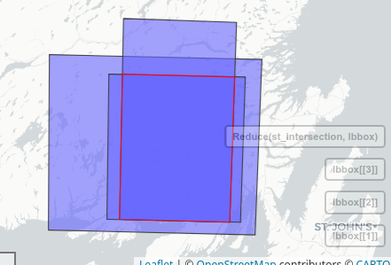
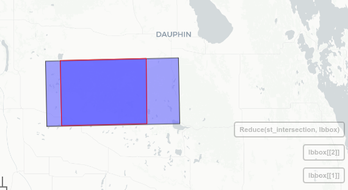

```{r setup, include=FALSE}
knitr::opts_chunk$set(echo = TRUE,
                      eval = TRUE,
                      message = FALSE,
                      warning = FALSE, 
                      cache = FALSE)
                      # TURN cache OFF)
```


Alright. I've spent a lot of time looking at this but unfortunately that hasn't translated to a lot of clear takeaways. If you decide you'd like to have a look at some different options for the analysis or the figures, please let me know. I'd be happy to help in any way I can. Some thoughts here, with code throughout. I'll highlight my notes with  \textcolor{red}{\textbf{NOTE:}}. 


## Setup 
```{r}
pkgs <- c('data.table', 'ggplot2', 'patchwork')
p <- suppressPackageStartupMessages(lapply(
  pkgs, 
  library, 
  character.only = TRUE)
)
```


## Data
\textcolor{red}{\textbf{NOTE:}} this data is slightly modified, as I swapped the old custom dyad_id function for the one now added to spatsoc, and used the new returnDist argument in the edge functions instead of recalculating after generating edges.

\textcolor{red}{\textbf{NOTE:}} A small note regarding differences between this and the sociality models R scripts: I've combined the caribou and elk data into a global `DT`. Downstream I've added `by = species` wherever necessary. 

```{r}
caribou <- readRDS('output/4-sociality/caribouNNA-ALR.Rds')
elk <- readRDS('output/4-sociality/elkNNA-ALR.Rds')

coordCols <- c('EASTING', 'NORTHING')
idCol <- 'id'

caribou[, species := 'caribou']
elk[, species := 'elk']

DT <- rbindlist(list(caribou, elk), fill = TRUE)
```


## Variables

### Scaling of RSF values

\textcolor{red}{\textbf{NOTE:}} Shouldn't this scaling be seasonal?

```
# from sociality-domain-GLM-*.R
DTsoc$z.avgpreyRSF<-scale(DTsoc$avgpreyRSF, center=T, scale=T)
DTsoc$z.avgpredatorRSF<-scale(DTsoc$avgpredatorRSF, center=T, scale=T)
DTsoc$z.avgcoyoteRSF<-scale(DTsoc$avgcoyoteRSF, center=T, scale=T)
DTsoc$z.avgbearRSF<-scale(DTsoc$avgbearRSF, center=T, scale=T)
```

```{r}
DT[, z.avgpreyRSF := scale(avgpreyRSF, center = T, scale = T)]
DT[, z.avgpredatorRSF := scale(avgpredatorRSF, center = T, scale = T)]

# By species*seasonal (since my DT includes both caribou+elk)
DT[, z.avgpreyRSFBy := scale(avgpreyRSF, center = T, scale = T), .(species, season)]
DT[, z.avgpredatorRSFBy := scale(avgpredatorRSF, center = T, scale = T), .(species, season)]

```


\textcolor{red}{\textbf{NOTE:}} Isn't this the second time scaling is performed? We scaled the global RSFs, then rescaled within the sampled points?

In scripts `NL-RSF.R` and `RMNP-RSF.R`:

```
### Rescale RSFs ----
q <- 0.999

winterQ <- quantile(winterCrop, q)
winterCrop[winterCrop > winterQ] <- winterQ

winterScaled <-
  (winterCrop - (cellStats(winterCrop, min))) /
  (quantile(winterCrop, q) - (cellStats(winterCrop, min)))

springQ <- quantile(springCrop, q)
springCrop[springCrop > springQ] <- springQ

springScaled <-
  (springCrop - (cellStats(springCrop, min))) /
  (cellStats(springCrop, max) - (cellStats(springCrop, min)))
```


### Bin 500m
```{r}
# Dyads within 500m 
setnames(DT, 'distance', 'dyadDist')
DT[dyadDist >= 500, bin500m := TRUE]
DT[dyadDist < 500, bin500m := FALSE]
```


\textcolor{red}{\textbf{NOTE:}} Is the threshold for *sociality* at 500m equally relevant for both elk and caribou? For social networks, usually we use a 50m threshold. That's much more conservative than what we are using here, but maybe there's some way to have a decay to di = 0, depending on distance? See more under [Plots/DI vs dyad dist](#didist) and [Plots/DI vs dyad dist by species](#didistsp).


Given this quote from: A critical examination of indices of dynamic interaction for wildlife telemetry studies

> "The DI approach, as in Cr,  measures  cohesiveness  irrespective  of  proximity between corresponding movement vectors (Table 2). Thus, to justify DI analysis, the researcher is required to havesomea prioriexpectation of cohesive movement, which, for example, can be based on proximity (defined by distance threshold dc), a measure of static interaction (e.g.home range overlap) or simultaneous capture (e.g. familial groups). DI can then be set to 0 when these conditions are not met"


```{r}
# Set DI to 0 if > 500m between dyads
DT[dyadDist >= 500, di0 := 0]
DT[dyadDist < 500, di0 := di]
```


\textcolor{red}{\textbf{NOTE:}} Is there a value less than 500m, relevant for setting DI to 0? As opposed to dropping nearest neighbours > 500m?


### Drop duplicated dyads
```{r}
# Drop duplicated dyads (won't be exactly half 
#   the number of rows because not all NN are NN with each other)
DT <- unique(DT[!is.na(NN)], by = c('dyadID', 'timegroup'))
```


### Global DI
Have we explored Global DI? 

I think global DI should likely be calculated for the full dataset, before subsetting.

```{r}
DT[, globalDI := mean(di0), .(season, dyadID)]
DT[, globalDIAngle := mean(diAngle), .(season, dyadID)]
DT[, globalDIDist := mean(diDist), .(season, dyadID)]
```

### Global average RSF
If we summarize dyads to a single value, we need a similar resolution RSF value

```{r}
DT[, globavgpredatorRSF := mean(avgpredatorRSF), .(season, dyadID)]
DT[, globavgpreyRSF := mean(avgpreyRSF), .(season, dyadID)]
```


### Subset
```{r}
DTsoc <- DT[dyadDist < 500]
```


\newpage

## Plots
\textcolor{red}{\textbf{NOTE:}} I've just plotted basic lines here, these are always just `geom_smooth(method = glm)`. I've left the spring elk in because it's simpler and I'd prefer to show the complete data for this purpose. 


### Difference in RSF and distance within dyad

This seems straightforward, some slightly positive trend with increasing dyad distance, that there would be a greater difference in RSF values

```{r, fig.height = 6}
# Dist vs diff in RSF
g1 <- ggplot(DTsoc, aes(dyadDist, dpreyRSF)) +
  geom_point(color = 'black', alpha = 0.5) +
  geom_smooth(method = glm)

g2 <- ggplot(DTsoc, aes(dyadDist, dpredatorRSF)) +
  geom_point(color = 'black', alpha = 0.5) +
  geom_smooth(method = glm)

g1 / g2 
```


\newpage

### DI and distance within dyad {#didist}

DI is not affected by distance of dyads, but this is interesting to see if there's any influence. If there is an obvious breakpoint, where we more commonly observe higher DI, maybe this can help understand if our threshold is too high?


```{r, fig.height = 5.5}
# Dist vs DI
g1 <- ggplot(DTsoc, aes(dyadDist, di)) +
  geom_point(color = 'black', alpha = 0.5) + geom_smooth(method = glm)

g2 <- ggplot(DTsoc, aes(di)) +
  geom_histogram() + geom_vline(aes(xintercept = 0.8), color = 'red') +
  labs(subtitle = 'chunks by interval dyad distance from 0-500')

g3 <- g2 + facet_wrap(~ cut_number(dyadDist, 4)) +
  labs(subtitle = 'chunks by number/equal count in each chunk')
g2 <- g2 + facet_wrap(~ cut_interval(dyadDist, 4))

g1 / g2 / g3
```


\newpage

### DI and distance within dyad *by species* {#didistsp}


```{r, fig.height = 5.5}
# Dist vs DI
g1 <- ggplot(DTsoc, aes(dyadDist, di)) +
  geom_point(color = 'black', alpha = 0.5) + geom_smooth(method = glm)+
  facet_wrap(~species)

g2 <- ggplot(DTsoc, aes(di)) +
  geom_histogram() + geom_vline(aes(xintercept = 0.8), color = 'red') +
  labs(subtitle = 'chunks by interval dyad distance from 0-500')

g3 <- g2 + facet_grid(species~ cut_number(dyadDist, 4), scales = 'free_y') + 
  labs(subtitle = 'chunks by number/equal count in each chunk')
g2 <- g2 + facet_grid(species ~ cut_interval(dyadDist, 4), scales = 'free_y')

g1 / g2 / g3
```

\newpage

### Average predator RSF and average prey RSF

```{r}
### Plots ----
g1 <- ggplot(DTsoc[species == 'caribou'], aes(avgpreyRSF, avgpredatorRSF)) + 
  geom_point(color = 'grey') + 
  geom_smooth(method = glm) + 
  ggtitle('caribou')

g2 <- ggplot(DTsoc[species == 'caribou'], aes(avgpreyRSF, avgcoyoteRSF)) + 
  geom_point(color = 'grey') + geom_smooth(method = glm)

g3 <- ggplot(DTsoc[species == 'caribou'], aes(avgpreyRSF, avgbearRSF)) + 
  geom_point(color = 'grey')  + geom_smooth(method = glm)

g4 <- ggplot(DTsoc[species == 'elk'], aes(avgpreyRSF, avgpredatorRSF)) + 
  geom_point(color = 'grey') +  geom_smooth(method = glm) + ggtitle('elk')

layout <- c('AD
             B#
             CE')
```

\newpage

### Average predator RSF and average prey RSF (cont.)

```{r, warning = FALSE, fig.height = 12, fig.width = 11}
(g1 + g2 + g3 + g4 & facet_grid(~ season)) + guide_area() +
  plot_layout(design = layout, guides = 'collect') 
```


\newpage


### DI and predator RSF

```{r, fig.height = 9, fig.width = 9}
g1 <- ggplot(DTsoc, aes(avgpredatorRSF, di)) 
g2 <- ggplot(DTsoc, aes(avgpredatorRSF, diAngle)) 
g3 <- ggplot(DTsoc, aes(avgpredatorRSF, diDist))

g1 / g2 / g3 & geom_point(color = 'grey') &
  facet_grid(season ~ species) &
  geom_smooth(method = glm)
```

\newpage


### DI and predator RSF - by dyad distance

```{r, fig.height = 10, fig.width = 9}
ggplot(DTsoc, aes(avgpredatorRSF, di)) +
  geom_point(alpha = 0.4) +
  facet_grid(season + species ~ cut_interval(dyadDist, 4)) +
  geom_smooth(method = glm)
```


\newpage

### DI and prey RSF

```{r, fig.height = 9, fig.width = 9}
g1 <- ggplot(DTsoc, aes(avgpreyRSF, di)) 
g2 <- ggplot(DTsoc, aes(avgpreyRSF, diAngle)) 
g3 <- ggplot(DTsoc, aes(avgpreyRSF, diDist))

g1 / g2 / g3 & geom_point(color = 'grey') &
  facet_grid(season ~ species) &
  geom_smooth(method = glm)
```

\newpage

### Global DI and global average predator RSF

```{r, fig.height = 8, fig.width = 9}
g1 <- ggplot(DTsoc, aes(globavgpredatorRSF, di)) 
g2 <- ggplot(DTsoc, aes(globavgpredatorRSF, diAngle)) 
g3 <- ggplot(DTsoc, aes(globavgpredatorRSF, diDist))

g1 / g2 / g3 & geom_point(color = 'grey') &
  facet_grid(season ~ species) &
  geom_smooth(method = glm)
```

\newpage

### Global DI and global average prey RSF

```{r, fig.height = 8, fig.width = 9}
g1 <- ggplot(DTsoc, aes(globavgpreyRSF, di)) 
g2 <- ggplot(DTsoc, aes(globavgpreyRSF, diAngle)) 
g3 <- ggplot(DTsoc, aes(globavgpreyRSF, diDist))

g1 / g2 / g3 & geom_point(color = 'grey') &
  facet_grid(season ~ species) &
  geom_smooth(method = glm)
```

\newpage


### \textcolor{red}{\textbf{NOTE:}} Spatial interaction of predator-prey domain
> L192: "In subsequent analyses, we estimated the predator-prey habitat domain spatially as the interaction between the predator and prey habitat domains"

We don't actually *spatially* interact the predator and prey domains right? 

How could we do this? Correlation of rasters? Difference between predator - prey RSF values? 

If we chose to look at something like the correlation and/or difference between rasters, we would need some amount of spatial and temporal overlap. There isn't a great temporal overlap of the RMNP data, but the NL data seems to be pretty good. 


Temporal overlap for NL
```
   species                  V1
    <char>              <POSc>
1:    BEAR 2008-05-30 18:00:53 - 2013-07-31 12:02:00
3:  COYOTE 2008-07-02 16:30:03 - 2014-02-20 02:18:40
5: CARIBOU 2009-05-21 02:00:14 - 2013-07-31 23:00:00
```

for RMNP

```
   species                  V1
    <char>              <POSc>
1:     ELK 2008-02-18 04:00:00 - 2016-07-30 21:00:00
3:    WOLF 2016-01-18 23:00:48 - 2018-03-05 12:00:13
```

If we chose to drop data outside of the minimum intersecting bounding box, or only create a predictive surface in that area, we might not lose much data:

```{r, echo = FALSE, fig.height = 3}

```


```{r, echo = FALSE, fig.height = 3}

```


```{r}
# This could be done on the point level eg
# (though I know this isn't likely exactly how we'd want to implement)
DTsoc[, predpreyRSF := predatorRSF - preyRSF]
DTsoc[, predpreyRSF.nn := predatorRSF.nn - preyRSF.nn]
```


